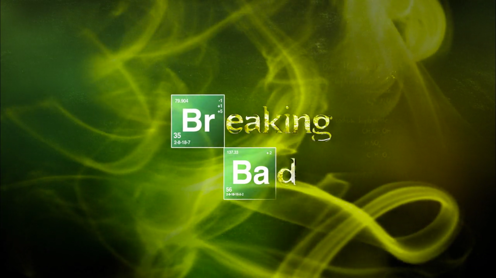
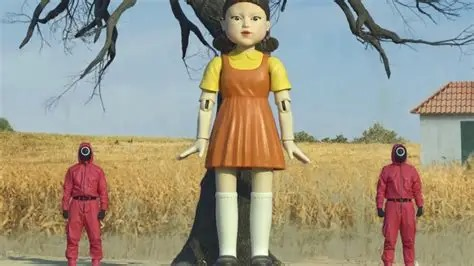

# NetFlix_Clone
## Date:
## Objective:
To create a modern, responsive navigation bar using CSS Flexbox, mimicking real-world websites like Netflix. This helps reinforce alignment, spacing, and layout structuring using Flexbox properties.

## Tasks:

#### 1. Structure the HTML Layout:
Use a ```<nav>``` tag as the main container.

Add a brand logo/title on the left using a ```<div> or <h1>```.

Add navigation links like Home, Menu, About, Contact, and Login using a ```<ul> with <li> and <a>```.

#### 2. Apply Flexbox for Layout:
Use display: flex on the ```<nav>``` container.

Use justify-content: space-between to align the logo and menu.

Use align-items: center to vertically center both sections.

Style list items with horizontal spacing using gap or margin.

#### 3. Style Like a Real-World Navbar:
Add background color (e.g., dark or gradient like Netflix/Zomato).

Style text with bold fonts, hover effects, and link styling.

Remove default ul and li styles (list-style: none, text-decoration: none).

#### 4. Bonus Enhancements:
Add a hover underline or button effect on links.

Make it responsive using flex-wrap or media queries.

Fix the nav bar to top with position: sticky.
## HTML Code:
```
<!DOCTYPE html>
<html lang="en">
<head>
  <meta charset="UTF-8">
  <meta name="viewport" content="width=device-width, initial-scale=1.0">
  <title>Netflix UI</title>
  <link rel="stylesheet" href="style.css">
</head>
<body>
  <div class="container">
    <div class="header">
      <div class="date">
        <h2 style="color:red">NETFLIX</h2>
        <p>| Thursday July 10</p>
      </div>
      <div class="menu">
        <p>Home</p>
        <p>Movies</p>
        <p>TV Shows</p>
        <p>Favourites</p>
      </div>
      <div class="icon">
        
      </div>
    </div>

    <div class="centerbody">
      <div class="content">
        <p class="tags">MAFIA | TV SHOW | KNOWLEDGE</p>
        <h1>Breaking Bad</h1>
        <p class="details">2009 | DIRECTOR : VINCE GILLIGAN | SEASON 1 (9 Episodes)</p>
        <p class="desc">High school chemistry teacher battling stage 3 lung cancer<br>opts for a different journey, a journey which puts his family at stake.</p>
        <div class="buttons">
          <button class="stream">STREAM NOW</button>
          <button class="episodes">ALL EPISODES</button>
        </div>
      </div>
      <div class="rightside">
        <p class="trailer"><span>&#9658;</span> Watch Trailer</p>
        <div class="age">18+</div>
        
      </div>

    </div>
    <div class="popular-shows">
    <h3>POPULAR SHOWS THIS WEEK</h3>
    <div class="show-list">
      <div class="show"><p>Squid game</p></div>
      <div class="show"><p>Wednesday</p></div>
      <div class="show"><p>Stranger Things</p></div>
      <div class="show"><p>One piece</p></div>
    </div>
  </div>
  </div>
</body>
</html>
```
## CSS Code:
```
* {
  margin: 0;
  padding: 0;
  box-sizing: border-box;
  font-family: 'Segoe UI', sans-serif;
}

body {
  background-color: red;
  display: flex;
  justify-content: center;
  align-items: center;
  height: 100vh;
}

.container {
  background-color: black;
  height: 600px;
  width: 1200px;
  box-shadow: 4px 4px 10px rgba(0, 0, 0, 0.5);
  display: flex;
  flex-direction: column;
  gap: 20px;
  padding: 20px 40px;
  overflow: hidden;
  position: relative;
}

.header {
  display: flex;
  justify-content: space-between;
  align-items: center;
  color: white;
}

.date,
.menu,
.icon {
  display: flex;
  gap: 10px;
  align-items: center;
  color: white;
}

.menu p {
  cursor: pointer;
}

.centerbody {
  display: flex;
  justify-content: space-between;
  align-items: flex-start;
  flex-grow: 1;
  margin-top: 20px;
}

.content {
  color: white;
  display: flex;
  flex-direction: column;
  gap: 15px;
  max-width: 600px;
}

.content .tags {
  font-size: 14px;
  color: gray;
}

.content h1 {
  font-size: 60px;
  letter-spacing: 2px;
}

.content .details {
  font-size: 14px;
  color: lightgray;
}

.content .desc {
  font-size: 13px;
  line-height: 1.4;
  color: gray;
}

.buttons {
  display: flex;
  gap: 15px;
}

.stream {
  background-color: red;
  color: white;
  border: none;
  padding: 10px 15px;
  font-weight: bold;
  cursor: pointer;
}

.episodes {
  background-color: transparent;
  color: white;
  border: 1px solid white;
  padding: 10px 15px;
  cursor: pointer;
}

.rightside {
  display: flex;
  flex-direction: column;
  align-items: flex-end;
  justify-content: space-between;
  height: 100%;
  padding-right: 20px;
}

.trailer {
  color: white;
  font-size: 14px;
  display: flex;
  align-items: center;
  gap: 5px;
  cursor: pointer;
}

.trailer span {
  font-size: 20px;
}

.age {
  background-color: red;
  color: white;
  padding: 5px 10px;
  font-size: 14px;
  border-radius: 3px;
  align-self: flex-end;
}

.popular-shows {
  color: white;
  margin-top: 20px;
  padding: 0 40px;
}

.popular-shows h3 {
  font-size: 16px;
  margin-bottom: 10px;
}

.show-list {
  display: flex;
  gap: 20px;
}

.show {
  display: flex;
  flex-direction: column;
  align-items: center;
  font-size: 12px;
  text-align: center;
}

.show img {
  width: 100px;
  height: 70px;
  object-fit: cover;
  border-radius: 5px;
}

.icon img{
  border-radius: 100%;
}

.custom-image {
  position: absolute;  
  top: 80px;         
  right: 40px;        
  width: 400px;       
  height: auto;       
  opacity: 0.15;     
  z-index: 1;         
  pointer-events: stroke; 
}
```

## Live web page:

## Output:


## Result:
A modern, responsive navigation bar using CSS Flexbox, mimicking real-world websites like Netflix. This helps reinforce alignment, spacing, and layout structuring using Flexbox properties is created successfully.
